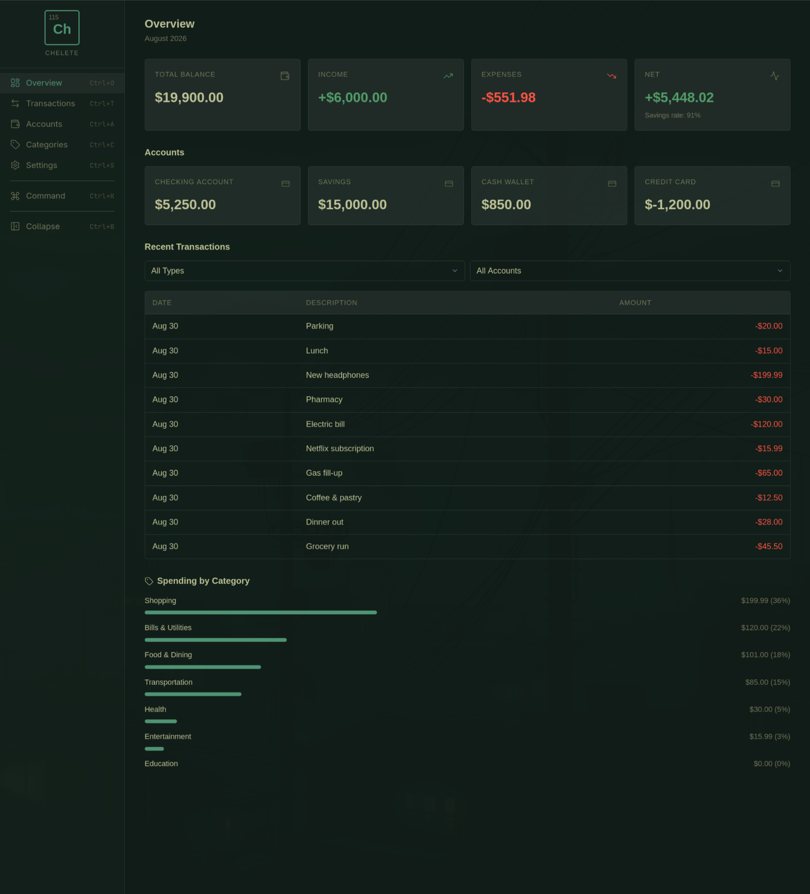
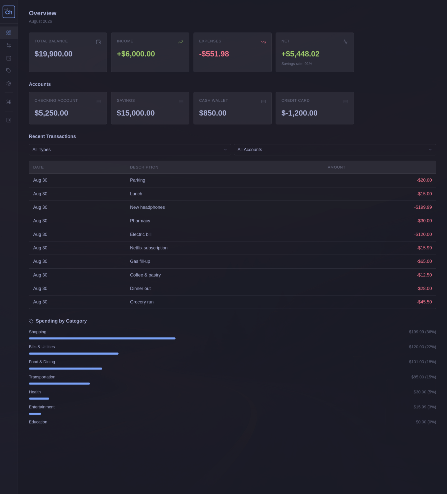
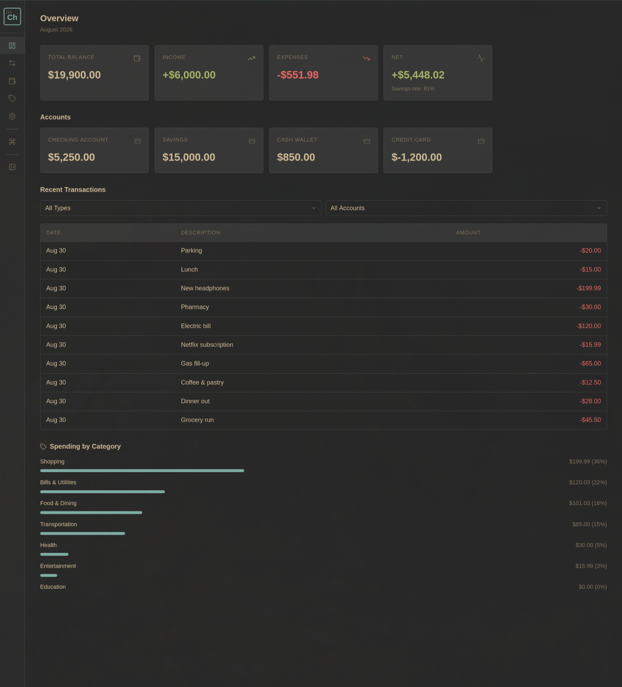
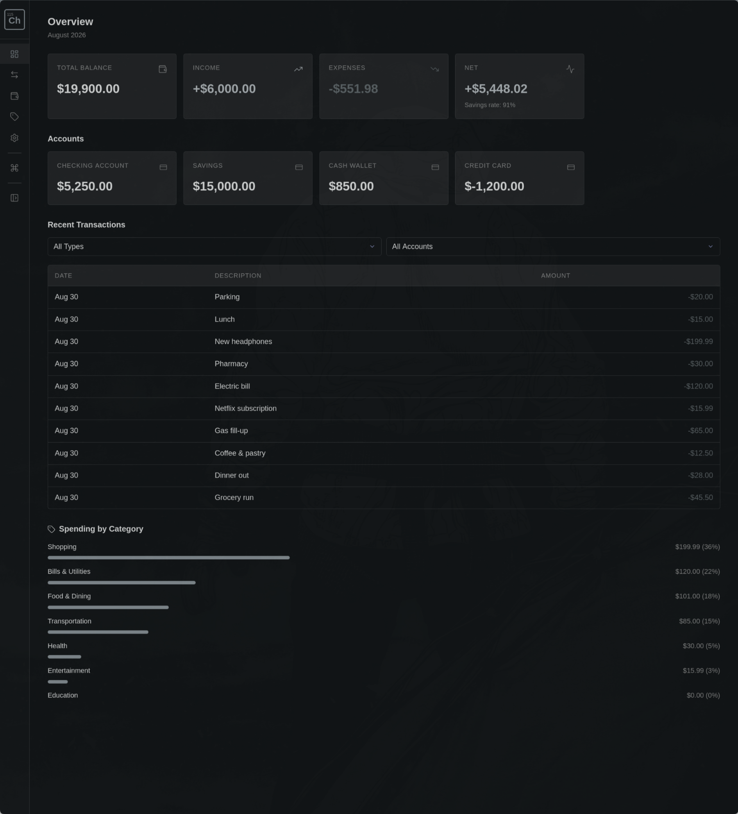
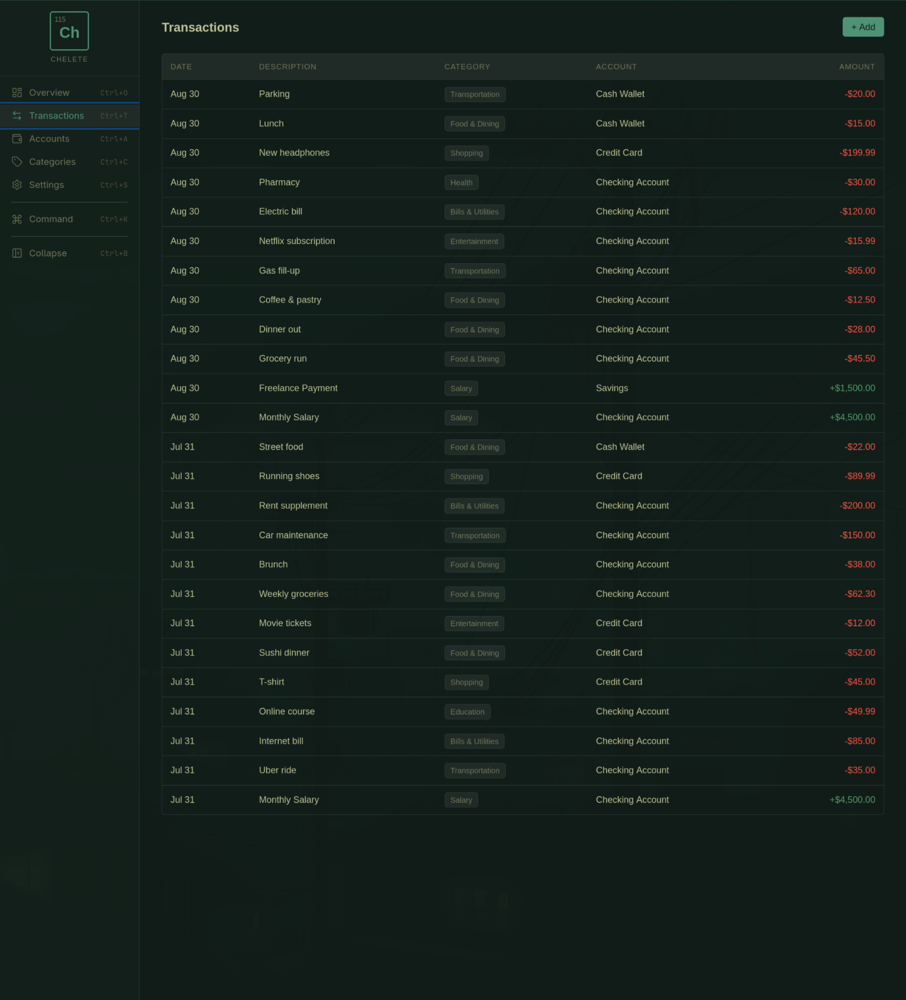
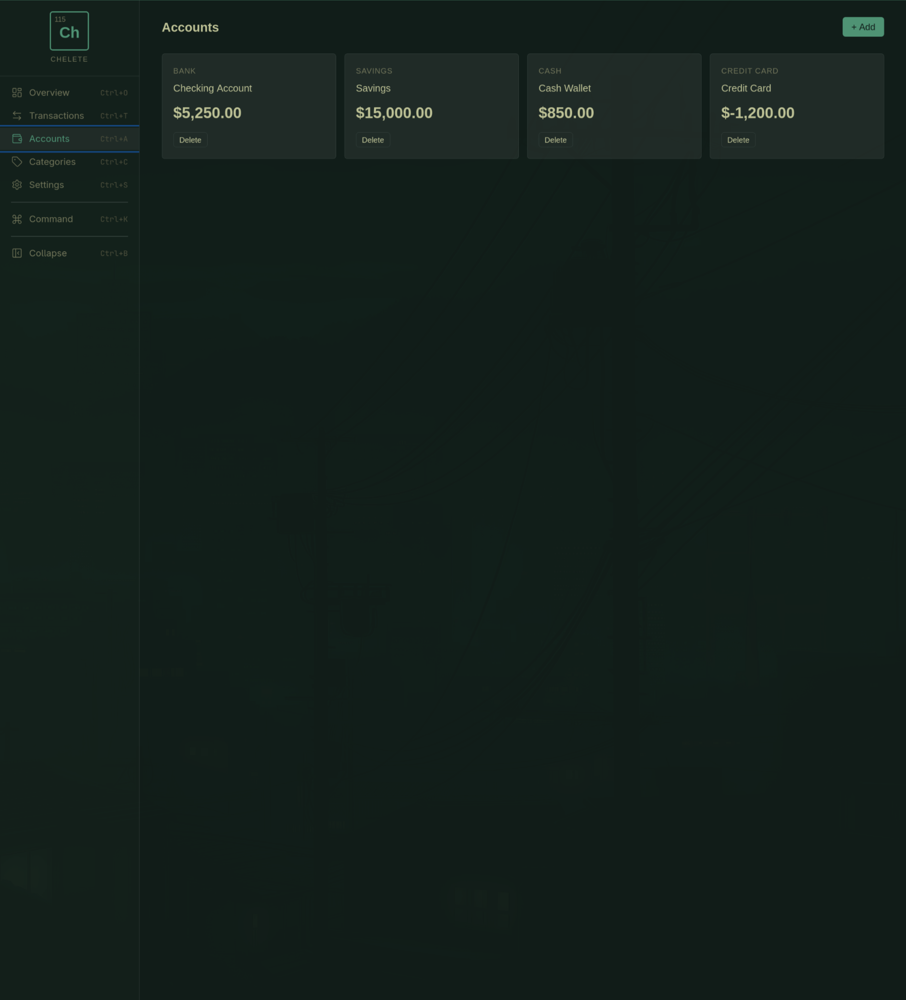
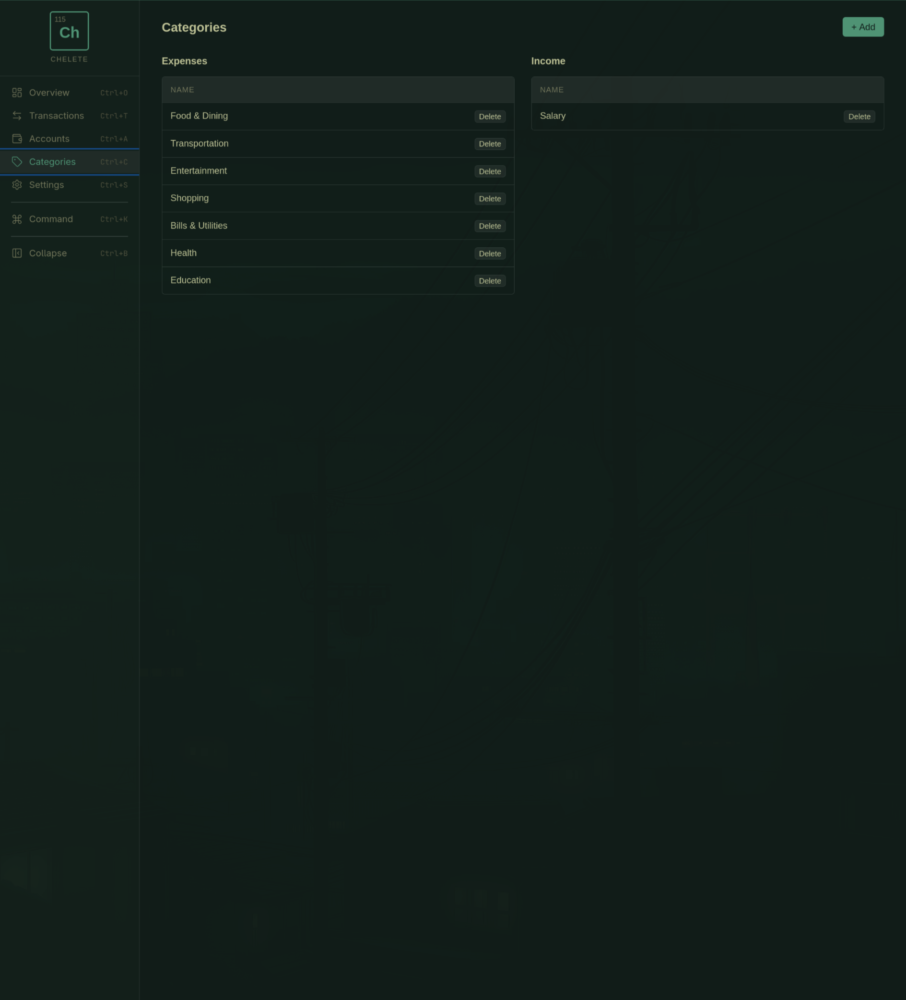
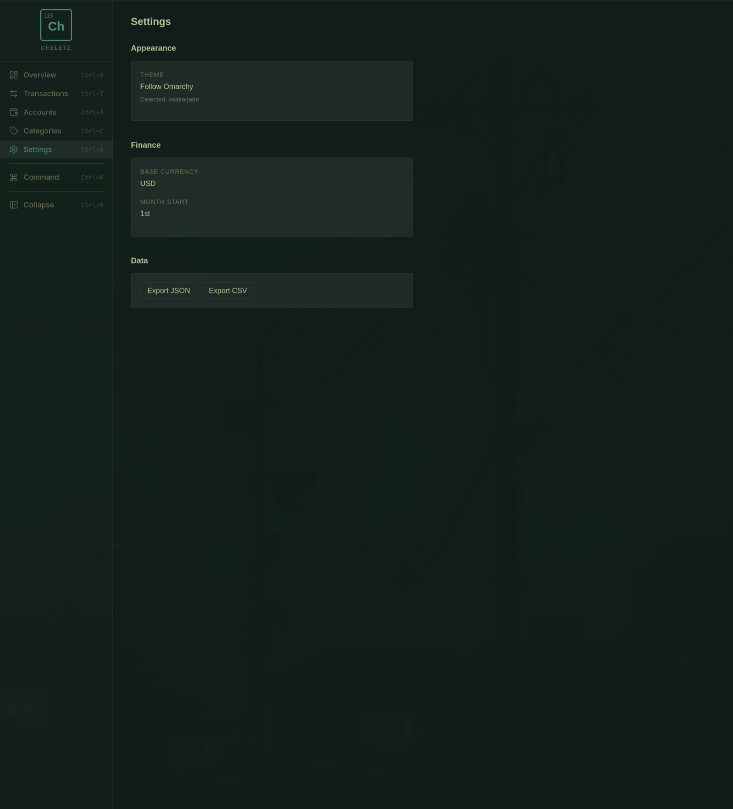
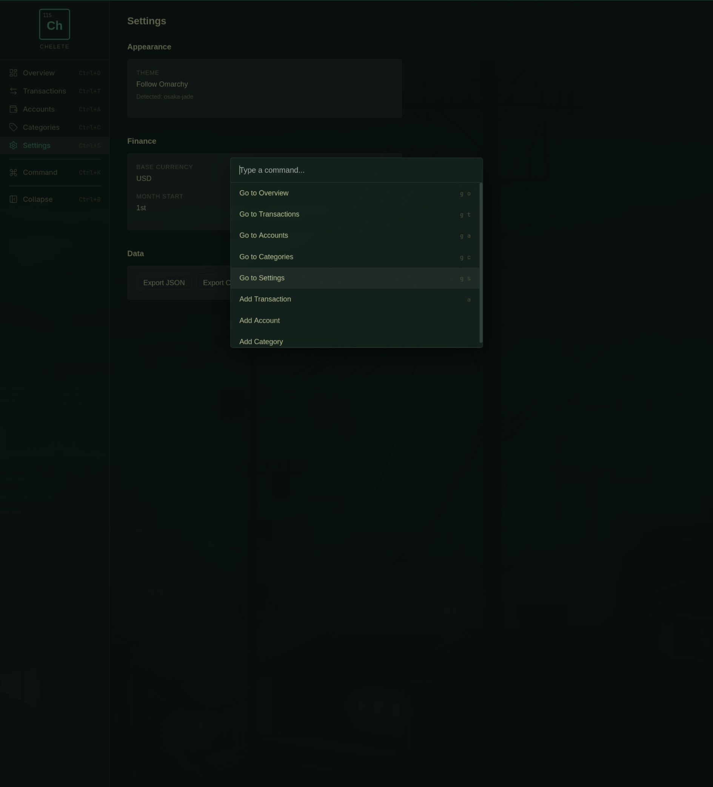
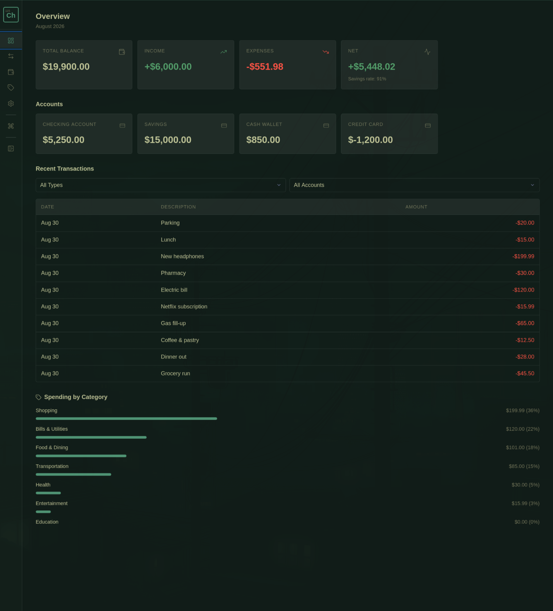

# Chelete

A fast, keyboard-driven personal finance tracker for Linux. Manage accounts, track spending, and visualize your finances without touching the mouse. Built for [Omarchy](https://github.com/basecamp/omarchy) with live theme integration — it adapts to whatever desktop theme you're running.



## Features

- Track accounts, transactions, and categories
- Overview dashboard with balance, income, and expenses
- Omarchy theme integration with live switching
- Keyboard-first navigation with Ctrl+ shortcuts
- Command palette (Ctrl+K)

## Omarchy Theme Integration

Chelete adapts to whichever theme is set in Omarchy. Switch your system theme and the app follows instantly.

| Tokyo Night | Gruvbox | Solitude |
|:-----------:|:-------:|:--------:|
|  |  |  |

## Screenshots

| Overview | Transactions | Accounts |
|:--------:|:------------:|:--------:|
|  |  |  |

| Categories | Settings | Command Palette |
|:----------:|:--------:|:---------------:|
|  |  |  |

| Overview (Collapsed) |
|:--------------------:|
|  |

## Tech Stack

- [Tauri](https://tauri.app/) — native desktop shell
- [React](https://react.dev/) — UI framework
- [TypeScript](https://www.typescriptlang.org/) — type safety
- [SQLite](https://www.sqlite.org/) — local database
- [Lucide](https://lucide.dev/) — icons

## Development

```bash
npm install
npm run tauri dev
```

## Build

```bash
npm run tauri build
```

## Usage

```bash
make test              # Run all tests
make seed              # Seed database with sample data
make release-patch     # Bump 0.1.0 -> 0.1.1 + git tag
make release-minor     # Bump 0.1.0 -> 0.2.0 + git tag
make release-major     # Bump 0.1.0 -> 1.0.0 + git tag
git push origin main --tags  # Triggers GitHub Actions release
```

## License

[MIT](LICENSE)
