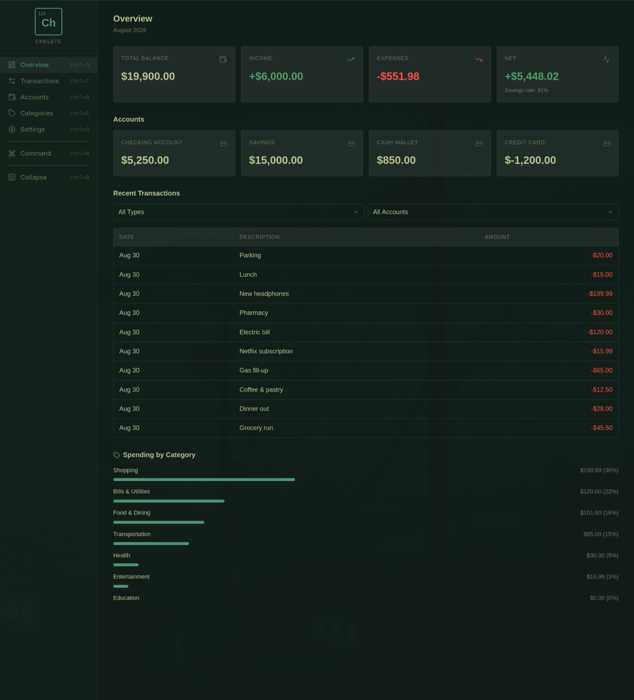
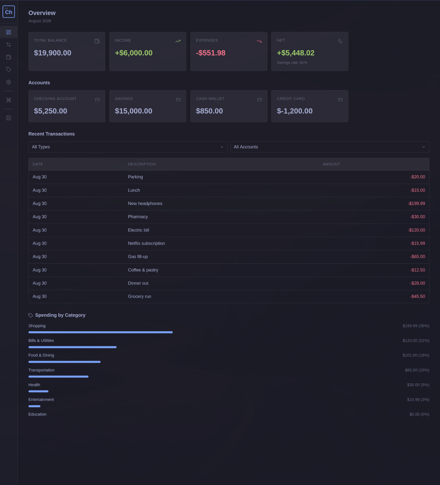
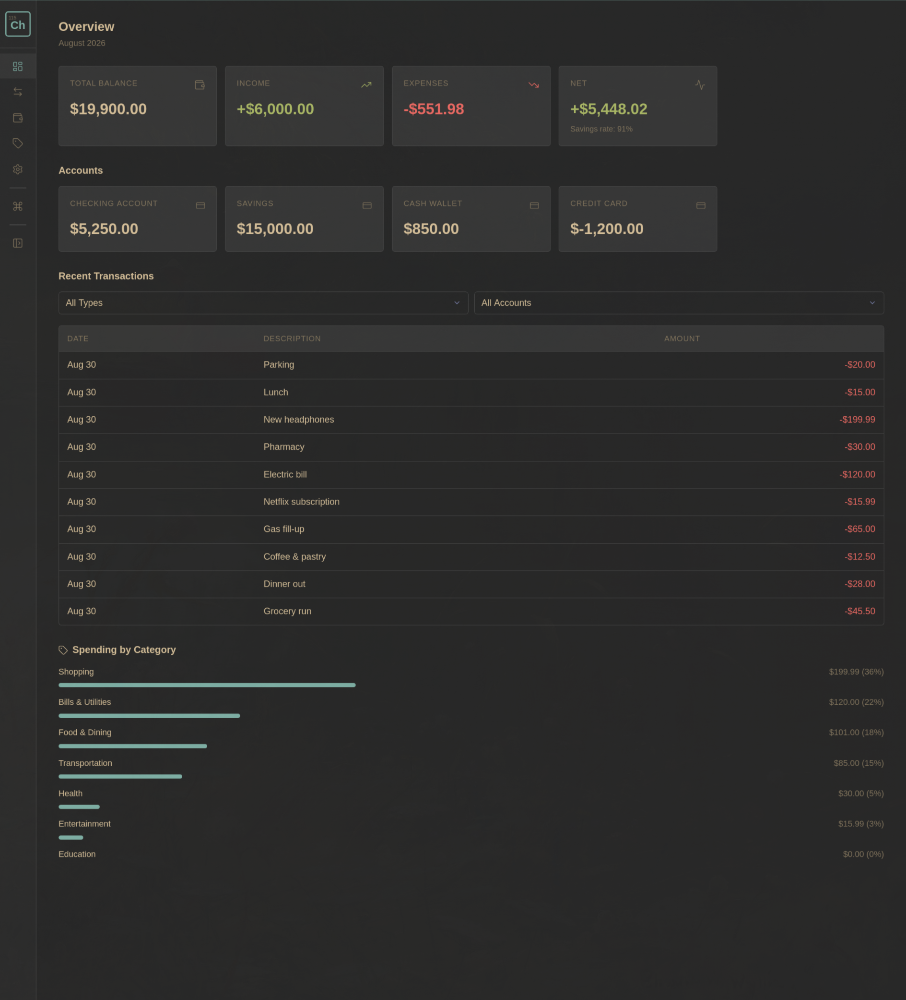
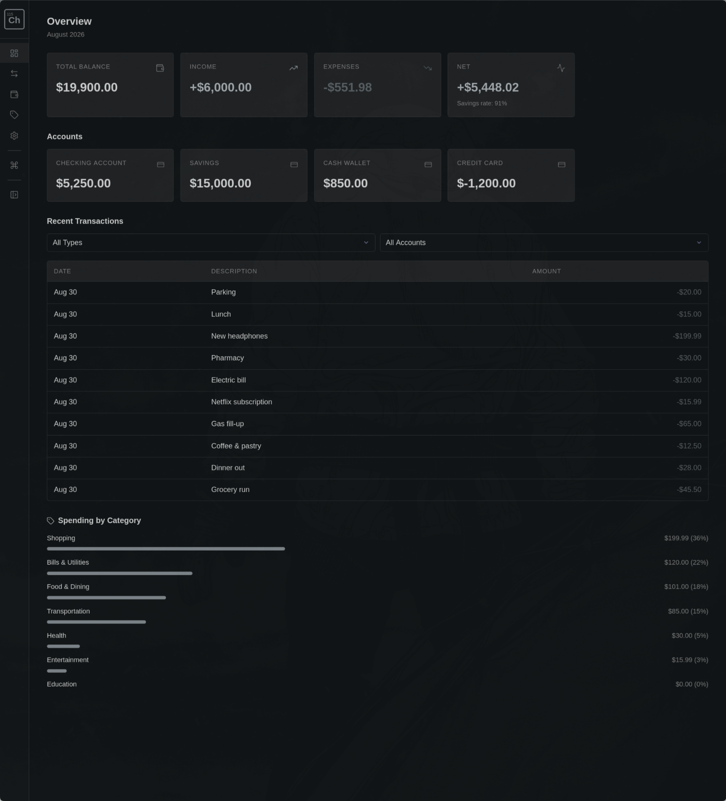
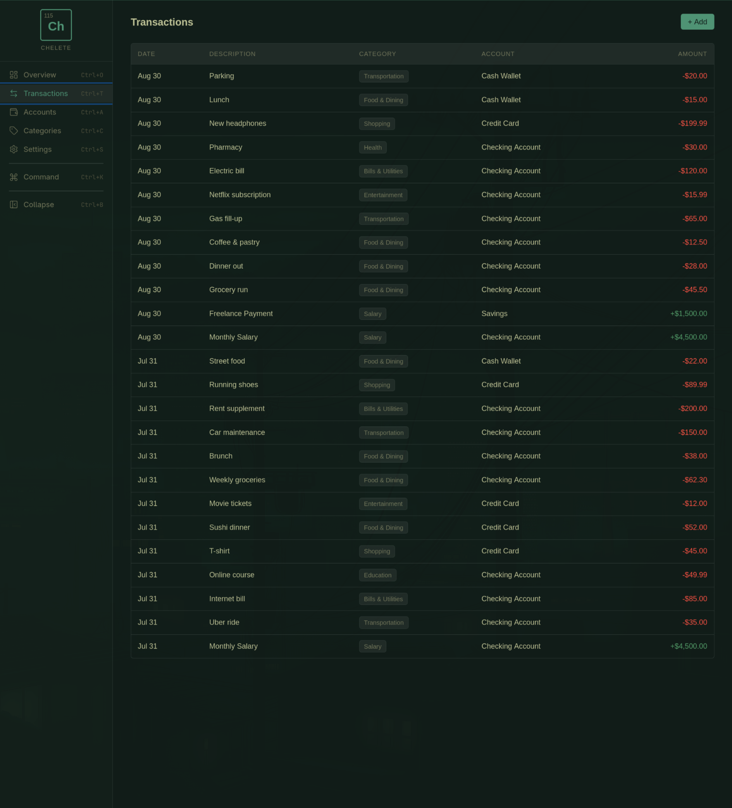
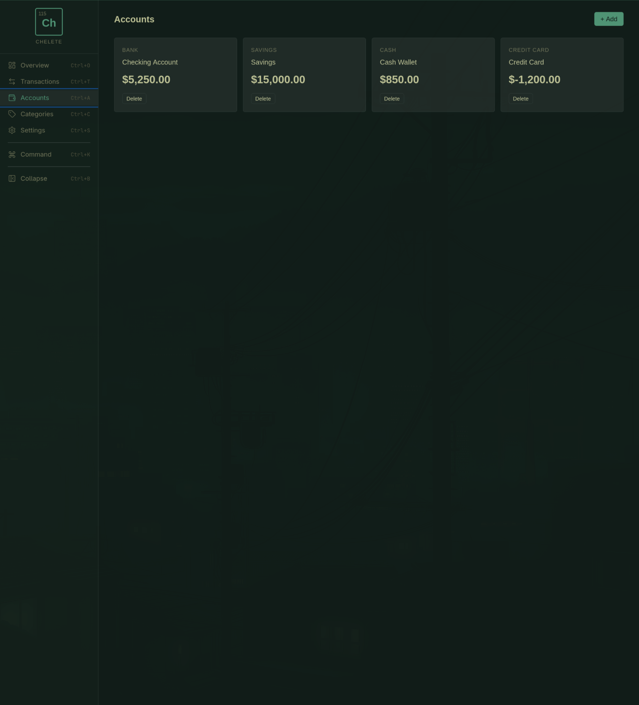
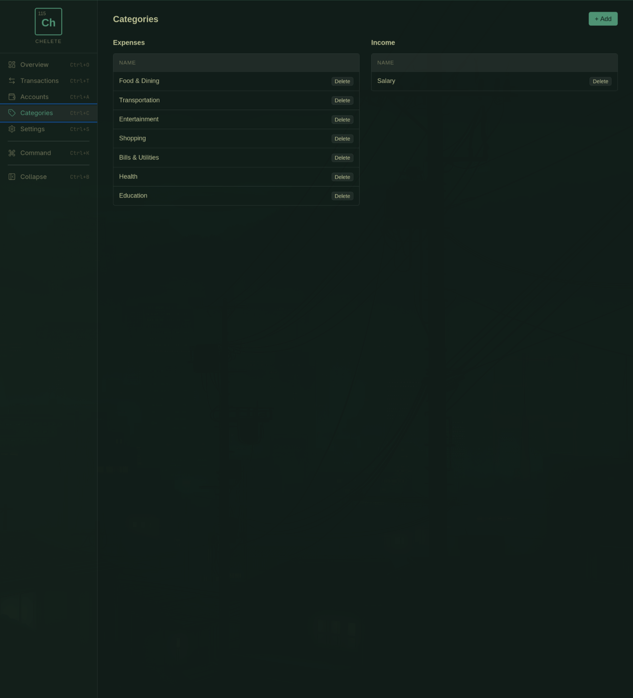
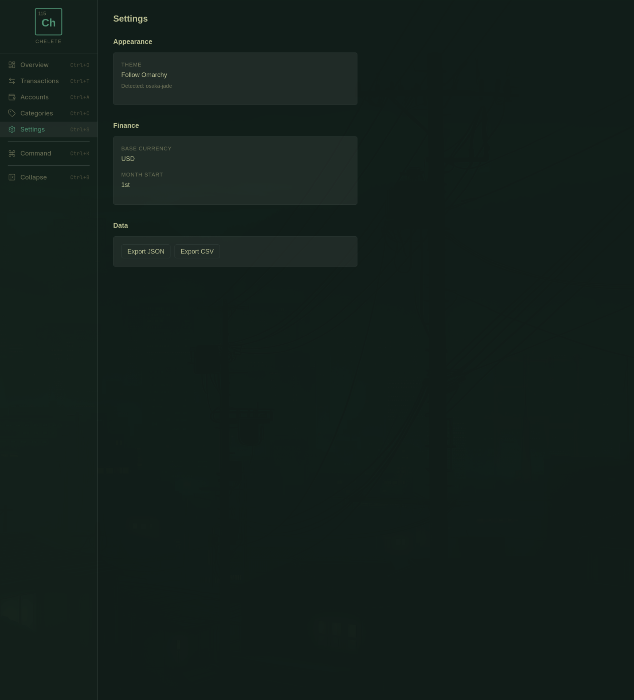
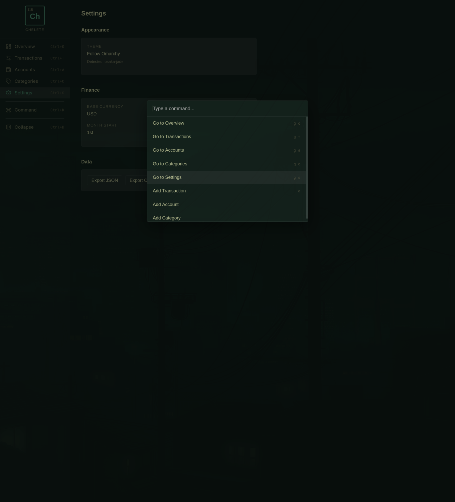
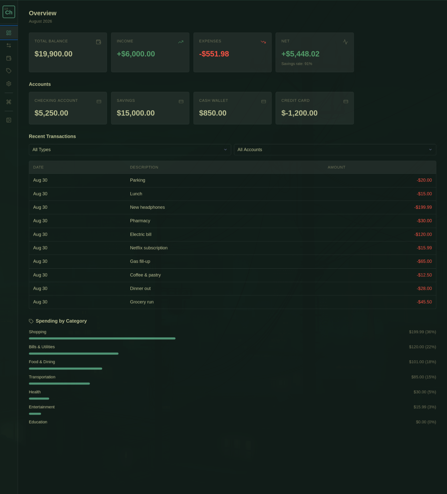

# Chelete

A fast, keyboard-driven personal finance tracker for Linux. Manage accounts, track spending, and visualize your finances without touching the mouse. Built for [Omarchy](https://github.com/basecamp/omarchy) with live theme integration — it adapts to whatever desktop theme you're running.



## Features

- Track accounts, transactions, and categories
- Overview dashboard with balance, income, and expenses
- Omarchy theme integration with live switching
- Keyboard-first navigation with Ctrl+ shortcuts
- Command palette (Ctrl+K)

## Omarchy Theme Integration

Chelete adapts to whichever theme is set in Omarchy. Switch your system theme and the app follows instantly.

| Tokyo Night | Gruvbox | Solitude |
|:-----------:|:-------:|:--------:|
|  |  |  |

## Screenshots

| Overview | Transactions | Accounts |
|:--------:|:------------:|:--------:|
|  |  |  |

| Categories | Settings | Command Palette |
|:----------:|:--------:|:---------------:|
|  |  |  |

| Overview (Collapsed) |
|:--------------------:|
|  |

## Tech Stack

- [Rust](https://www.rust-lang.org/) — the whole app, UI included
- [GPUI](https://www.gpui.rs/) through [gpui-kit](https://gpui-kit.com/) — GPU-rendered native UI
- [gpui-omarchy](https://github.com/huacnlee/gpui-omarchy) — Omarchy-styled controls and live theme following
- [SQLite](https://www.sqlite.org/) (rusqlite) — local database
- [Lucide](https://lucide.dev/) — icons, from the gpui-kit asset bundle

## Requirements

Build dependencies on Linux: a Rust toolchain, `clang`, `cmake`, `pkg-config`, and the development packages for Wayland, xkbcommon, fontconfig and Vulkan.

On Arch / Omarchy:

```bash
sudo pacman -S --needed rust clang cmake pkgconf wayland libxkbcommon libxkbcommon-x11 fontconfig vulkan-icd-loader
```

## Development

```bash
make dev       # cargo run
make test      # cargo test (library and headless UI tests)
```

The UI tests run the real screens headlessly with simulated keystrokes, so they need no display.

## Build

```bash
make build     # cargo build --release
```

## Backups

`make install-local` also installs a systemd user timer that dumps the database to `~/Documents/chelete/backup.json` every hour (needs `sqlite3` and `jq`). Check it with `systemctl --user list-timers chelete-backup`.

## Usage

```bash
make test              # Run all tests
make seed              # Seed database with sample data
make release-patch     # Bump 0.1.0 -> 0.1.1 + git tag
make release-minor     # Bump 0.1.0 -> 0.2.0 + git tag
make release-major     # Bump 0.1.0 -> 1.0.0 + git tag
git push origin main --tags  # Triggers GitHub Actions release
```

Data lives in `~/.local/share/com.chelete.app/` (the same place earlier versions used, so existing data carries over).

### Keyboard

| Keys | Action |
|:-----|:-------|
| `Ctrl+O` `T` `A` `C` `U` `P` `S` | Overview, Transactions, Accounts, Categories, Subscriptions, Projections, Settings |
| `Ctrl+K` | Command palette |
| `Ctrl+B` | Collapse the sidebar |
| `Ctrl+=` `Ctrl+-` `Ctrl+0` | Larger text, smaller text, reset (also in Settings) |
| `Esc` / `Enter` | Close a dialog / submit a form |
| `Ctrl+Q` | Quit |

## Special Thanks

- **Victor Phos** — The Architect & QA
- **ChatGPT** — For planning
- **MiMo V2.5** — For implementation
- **Kimi K2.7 Code** — For implementation

## License

[MIT](LICENSE)
